  
  
  

### `01 ·` sobre mim

Sou estudante do 11.º ano do curso de Programador de Informática, curioso e dedicado, com gosto por criar soluções práticas com código. Interesso-me por front-end, back-end e inteligência artificial.

### `02 ·` formação e destaques

**Curso Profissional de Programador de Informática** · `2025 — 2028` 
Oficina — Escola Profissional · 11.º ano (a frequentar)

- **Prémio de Mérito Escolar** · Santo Tirso · `2026`
- Mini estágio · Oficina · `2025`
- Evento de divulgação da oferta formativa · Oficina · `2026`
- Voluntário no dia aberto · Oficina · `2026`

### `03 ·` stack

### `04 ·` projetos em destaque

<table>
  <tr>
    <td width="33%" valign="top">
      <b>Jogo de soletração gestual</b> 
      Jogo baseado no popular “Termo”, adaptado para a Língua Gestual.  
      <code>JavaScript</code> <code>React</code>  
      <a href="https://oficina-tremo.vercel.app">demo ↗</a> · <a href="https://github.com/a14816-AMR/Oficina-Tremo">código</a>
    </td>
    <td width="33%" valign="top">
      <b>WebApp de identificação de objetos</b> 
      Aplicação web de reconhecimento e identificação visual de objetos.  
      <code>JavaScript</code> <code>HTML/CSS</code>  
      <a href="https://object-identification-tan.vercel.app">demo ↗</a> · <a href="https://github.com/a14816-AMR/Identificacao_de_Objeto">código</a>
    </td>
    <td width="33%" valign="top">
      <b>Reconhecimento facial</b> 
      Ferramenta web de autenticação e segurança biométrica com modelos de reconhecimento facial.  
      <code>JavaScript</code> <code>HTML</code>  
      <a href="https://github.com/a14816-AMR/oficina-reconhecimento-facial-nodejs">código</a>
    </td>
  </tr>
</table>

<table>
  <tr>
    <td width="50%" valign="top">

### `05 ·` soft skills

- curiosidade 
- comunicação 
- vontade de aprender 
- resolução de problemas 
- organização

</td>
    <td width="50%" valign="top">

### `06 ·` idiomas

português · `nativo` 
inglês · `B2` 
francês · `A2`

</td>
  </tr>
</table>
