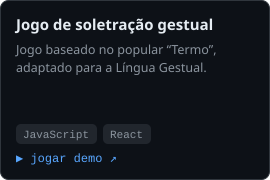
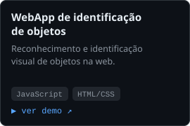
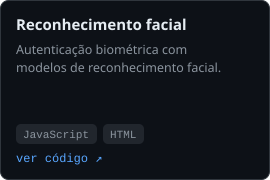
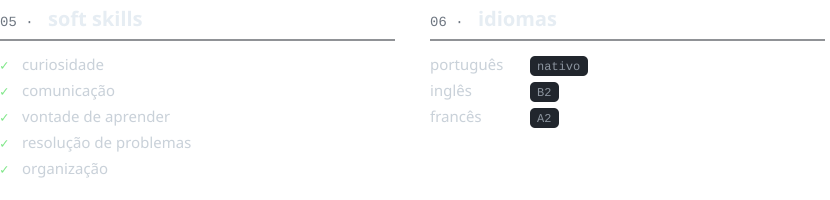

  
  
  

### `01 ·` sobre mim

Sou estudante do 11.º ano do curso de Programador de Informática, curioso e dedicado, com gosto por criar soluções práticas com código. Interesso-me por front-end, back-end e inteligência artificial.

### `02 ·` formação e destaques

🎓 **Curso Profissional de Programador de Informática** · `2025 — 2028` 
Oficina — Escola Profissional · 11.º ano (a frequentar)

- 🏅 **Prémio de Mérito Escolar** · Santo Tirso · `2026`
- 💼 Mini estágio · Oficina · `2025`
- 📣 Evento de divulgação da oferta formativa · Oficina · `2026`
- 🤝 Voluntário no dia aberto · Oficina · `2026`

### `03 ·` stack

### `04 ·` projetos em destaque

  
  
  

código: <a href="https://github.com/a14816-AMR/Oficina-Tremo">soletração gestual</a> · <a href="https://github.com/a14816-AMR/Identificacao_de_Objeto">identificação de objetos</a> · <a href="https://github.com/a14816-AMR/oficina-reconhecimento-facial-nodejs">reconhecimento facial</a>

  

